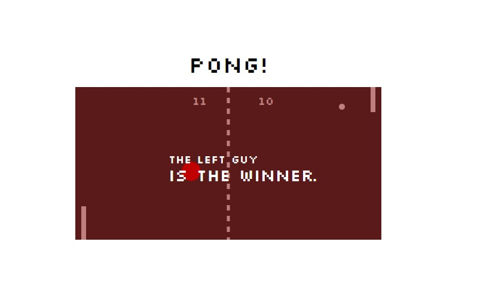

## Pong Game Starter

**version 1.0.0

this is a pong game with some additional features and challenges.

## Quick start

* Clone the git repo — `git clone
  https://github.com/ermia-afshaian/quotes-on-dev`  
* Install with [npm](https://www.npmjs.com/): `npm install`.
* run gulp

**Install dependencies:**

`$ npm install`

**Run locally with the Parcel dev server:**

`$ npm start`

Once you run the start command you can access your project at http://localhost:3000.

Read more about the [Parcel web application bundler here](https://parceljs.org/).

## Personal learnings

* writing object oriented javascript code
* using svg and how to create images and logos with it.
* javascript canvas and animation
## contributers

-ermia afsharian
## License

The code is available under the [MIT license](LICENSE.txt).# quotes-on-dev

